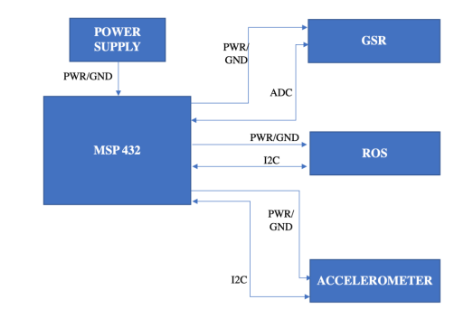

# Embedded Systems and Firmware

## Overview
This repository contains all the code written for the embedded system portion of our senior design project. The specific sub directories are listed below.

  
  
Attached is an image of our final embedded system in block diagram form. There are 2 I2C peripherals and 1 ADC peripheral to our system. All hardware components can be found in the Hardware directory.

## Subdirectories

### Drivers
This directory contains all the low level drivers used in our project. Most of the driver code is courtesy of Dr. Jon Valvano at UT Austin. Significant driver files include AP.c which is the bluetooth code for the CC2650 bluetooth module we used.

In addition, included here are several UART drivers, Clock Management drivers, and generic Input and Output over GPIO pins. Note that the MSP432P401R has a mostly complete driver library for most of these functions, but this involved less overhead for the device. Thus we mainly used these drivers rather than the TI drivers.

### Sensor Test Projects
This directory contains test projects for the low level sensor drivers developed for the MSP432P401R in this project. The Reflective Optical Sensor that we use, the MAX30102, uses an I2C interface. The low level driver interface was developed and tested uisng the MAX30102 project. The accelerometer, the MMA8451, was developed using the Accelerometer_Test project. Both interfaces uses a similar form of I2C. For convienence, they are interfaced to different I2C modules on the MSP432.

The GSR sensor is interfaced to an ADC input. There is not currently an ADC interface, but if interested, see the Self-Monitor Stress System project. It contains the ADC code to interface the Grove GSR sensor.

This directory also contains the bluetooth test program used for our project. This is shown in "Bluetooth_Sensor" which communicates the status of the built in LEDs on the MSP432 launchpad. This was tested using LightBlue as well as our custom iOS application, so we know that the bluetooth works for this design.

### MSP432 Example Code
This directory contains code examples for turning on and off an LED and using the 32 bit timer on the MSP432P401R. These projects were for us to become familiar with the MSP432 microcontroller.

### Self Monitor Stress System
This project was our first attempt at putting all the pieces of our design together. The device reads Accelerometer, ROS, and GSR inputs and then calculates heart rate. It then attempts to send the data via bluetooth. We found that our device could not meet all the deadlines and still communicate reliably with our mobile application. Attempts to interleave the data calculations helped our deadlines. We found that calculating heart rate was the major bottleneck in our software. This project was suspended due to a change in project priorities.

### Self Monitor Stress System v2
This project was our final deliverable for software. The software reads all the data from the sensors and then communicates the data through UART0 to a Putty terminal. Data is then saved and converted to a CSV file. This works very reliably, but continuously samples data. If this is an issue for the user, you can use the TIMER32 to only sometimes send out data via UART0.
